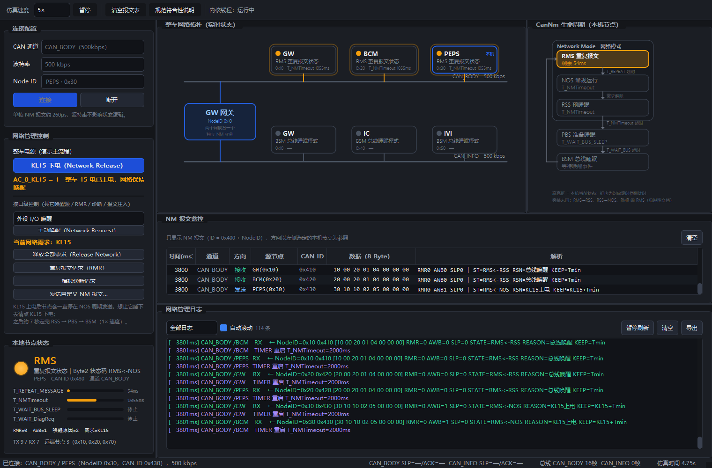
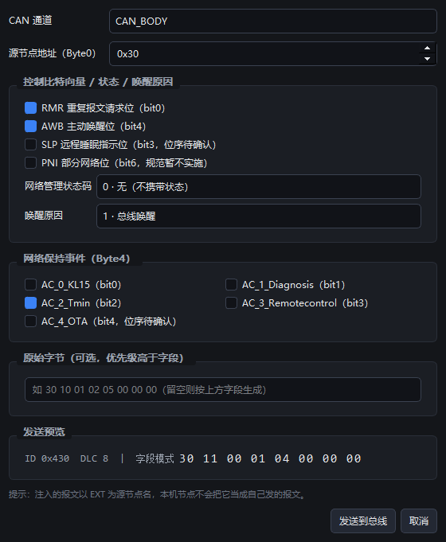

# AUTOSAR CanNm 网络管理仿真上位机 — 运行手册

基于 Python + PyQt5 的 AUTOSAR CAN 网络管理（CanNm）模拟上位机。**纯软件动画演示，不接实物**，
用于在网络联调之前把 NM 状态机、报文时序、同步休眠/唤醒流程跑给人看。

演示主角是**网关**：网关横跨车身网与信息网，两个网段的 NM 状态彼此独立 ——
这是网络管理最容易被讲错、也最值得演示的地方。



---

## 目录

1. [这是什么](#1-这是什么)
2. [环境准备](#2-环境准备)
3. [三种运行方式](#3-三种运行方式)
4. [5 分钟上手：演示脚本](#4-5-分钟上手演示脚本)
5. [界面逐块说明](#5-界面逐块说明)
6. [命令行参数](#6-命令行参数)
7. [配置与定制](#7-配置与定制)
8. [测试与文档](#8-测试与文档)
9. [目录结构与改哪里](#9-目录结构与改哪里)
10. [常见问题排查](#10-常见问题排查)
11. [设计要点](#11-设计要点)
12. [待客户确认清单](#12-待客户确认清单)
13. [已知限制与后续增强](#13-已知限制与后续增强)

---

## 1. 这是什么

一个 CAN 网络管理状态机演示工具，可以：

- 同时模拟 **5 个 ECU**（网关横跨两个网段，共 **6 个彼此独立的 NM 实例**），每个实例都跑完整的
  AUTOSAR CanNm 状态机；
- 可视化 **5 个 NM 状态**：BusSleepMode / PrepareBusSleepMode / RepeatMessageState /
  NormalOperationState / ReadySleepState；
- 实时显示 **NM 报文的 8 个字节**及其解析（RMR / AWB / 睡眠指示位 / 状态码 / 唤醒原因 / 保持事件）；
- 界面上有两块**实时图形**：整车网络拓扑图（节点颜色跟着真实状态变）与 CanNm 生命周期流程图（高亮当前状态）；
- 用按钮模拟应用层动作：**整车 KL15 上下电、主动唤醒、释放需求、重复报文请求、诊断请求**，并能**手工注入自定义 NM 报文**；
- 打印带仿真时间戳的完整收发与状态迁移日志，可筛选、暂停、导出。

它**不会**连接真实 CAN 硬件，也不需要 CAN 卡。将来要接真实总线，只需替换
`src/core/virtual_bus.py`（换成 python-can 包装），状态机与界面代码一行都不用改。

---

## 2. 环境准备

### 2.1 依赖

| 项目 | 要求 | 说明 |
| --- | --- | --- |
| Python | **3.9 及以上**（本项目在 3.13.14 上验证通过） | 内核只用标准库 |
| PyQt5 | 5.15.x（验证版本 **PyQt5 5.15.11 / Qt 5.15.2**） | **只有启动界面才需要** |
| 操作系统 | Windows / Linux / macOS | 在 Windows 10/11 上验证 |

内核（`sim_demo.py`、单元测试）**零第三方依赖**，不装 PyQt5 也能跑。

### 2.2 安装

```bash
cd <项目根目录>

# 建议用虚拟环境，避免污染系统 Python
python -m venv .venv
.venv\Scripts\activate            # Windows
# source .venv/bin/activate       # Linux / macOS

pip install -r requirements.txt
```

国内网络如果下载慢，加个镜像源：

```bash
pip install -r requirements.txt -i https://pypi.tuna.tsinghua.edu.cn/simple
```

### 2.3 验证环境（推荐先跑这一步）

```bash
python main.py --smoke
```

正常会输出类似：

```
[启动] 已自动连接 CAN_BODY / Node ID 0x10，速度 1×
[自检] 仿真时间 3.03s｜本机状态 NOS｜报文表 4 行｜日志 32 行｜内核线程：运行中
[自检] 线程停止与界面复位：正常
[自检] 结论：通过，环境可用
```

自检模式**不弹出窗口**，跑 3 秒后自动连接、唤醒、读回界面上的实际数据、再断开退出。
看到「结论：通过」就说明环境和内核都没问题，可以直接进入下一步。

---

## 3. 三种运行方式

### 3.1 图形界面（主要用法）

```bash
python main.py
```

启动后左侧是配置与操作区，**先选通道和 Node ID，点「连接」**，仿真就开始跑（初始所有节点都在总线睡眠模式）。
完整点击流程见第 4 节。

常用变体：

```bash
python main.py --speed 5                      # 5 倍速启动（演示同步休眠建议用 5~10 倍速）
python main.py --auto-connect                 # 启动即自动连接，省一次点击
python main.py --channel CAN_INFO --node-id 0x10 --auto-connect
python main.py --config config/network.json   # 指定配置文件
```

### 3.2 无界面场景回放（内核自检 / 出报告用）

不打开界面，直接把一段完整场景跑完并打印时间轴，适合在没有显示器或想留一份文字记录时用：

```bash
python sim_demo.py                  # 默认 customer_a 参数，跑 20 秒场景
python sim_demo.py --summary-only   # 只打印状态时间线与统计
python sim_demo.py --profile qingling_v1
```

输出的关键一段是「状态迁移时间线」（节点 × 时间）：

```
CAN_BODY  PEPS  BSM@0ms → RMS@1000ms → NOS@2000ms → RSS@8000ms → PBS@10000ms → BSM@15000ms
CAN_BODY  GW    BSM@0ms → RMS@1002ms → RSS@2001ms → PBS@10001ms → BSM@15001ms
CAN_BODY  BCM   BSM@0ms → RMS@1002ms → RSS@2001ms → PBS@10001ms → BSM@15001ms
CAN_INFO  GW    BSM@0ms → RMS@1202ms → NOS@2202ms → RSS@11000ms → PBS@13000ms → BSM@18000ms
CAN_INFO  IC    BSM@0ms → RMS@1204ms → RSS@2203ms → PBS@13001ms → BSM@18001ms
CAN_INFO  IVI   BSM@0ms → RMS@1204ms → RSS@2203ms → PBS@13001ms → BSM@18001ms
```

这段刚好把网络管理最核心的两件事讲清楚了：

- **GW / BCM 在 1002ms 被唤醒，但自己没需求，2001ms 就进了 Ready Sleep；之后 PEPS 每 1000ms 一帧 NM 报文
  不断重启它们的 T_NMTimeout，硬是把睡眠推迟到 10001ms** —— 这就是"同睡同醒"。
- **CAN_INFO 是 1202ms 才被拉起来的**（比车身网晚 200ms），因为 NM 报文不跨网段路由，
  信息网必须由网关应用层决定后才拉起。

### 3.3 离屏截图（做交付材料用）

不需要显示器，自动连接、唤醒、注入报文、释放，然后把界面和对话框存成 PNG：

```bash
python tools/ui_screenshot.py
# 产物：docs/ui_preview.png、docs/ui_dialog_preview.png
```

---

## 4. 5 分钟上手：演示脚本

### 场景 A：单节点完整生命周期（最基本的演示）

| 步骤 | 操作 | 预期现象 |
| --- | --- | --- |
| 1 | 通道选 `CAN_BODY`，Node ID 选 `PEPS · 0x30`，点**连接** | 6 个节点卡片全部是灰色「BSM 总线睡眠模式」，日志出现 6 条 `CanNm_Init()` |
| 2 | 点 **KL15 上电**（整车电源开关） | 开关变成「KL15 下电」，`AC_0_KL15 = 1`；PEPS 卡片变**琥珀色并闪烁**（RMS）；报文表连续出现 5 帧 `0x430`，间隔 **100ms**（快速发送）；Byte1 的 `AWB=1`、Byte3 第一帧是 `REASON=初始化`、第二帧起变 `KL15上电` |
| 3 | 等待约 1 秒（T_REPEAT_MESSAGE=1000ms） | PEPS 变**绿色**（NOS），报文周期变成 **1000ms**；**AWB 仍保持 1**（规范要求保持到进入 RSS）；GW/BCM 因收到报文被**被动唤醒**（注意它们的 `AWB=0`，与 PEPS 不同） |
| 4 | 观察 GW / BCM 卡片 | 它们没有本地需求，1 秒后就变成**蓝色 RSS**（Ready Sleep）—— 但仍在收报文，T_NMTimeout 被不断重启，**不会睡下去** |
| 5 | 点 **KL15 下电** | PEPS 变蓝 RSS，AWB 此刻才清零；并**补发一帧**带 `SLP=1` 的 NM 报文（Byte1 的 bit3 置 1，这是"我要睡了"的广播）；日志出现「网络级 SleepIndication 置起」 |
| 6 | 等 2 秒（T_NMTimeout） | 所有节点变灰 PBS，日志出现「网络级 SleepAcknowledge 置起」 |
| 7 | 等 5 秒（T_WAIT_BUS_SLEEP） | 所有节点回到暗色 BSM，总线彻底静默，`总线 …帧` 计数不再增长 |

> 1 倍速下从唤醒到完全休眠共约 7 秒。演示时建议把工具栏速度调到 **5× 或 10×**（第 7 步只要 0.7 秒）。

### 场景 B：网关的两个网段相互独立（**推荐重点演示**）

| 步骤 | 操作 | 预期现象 |
| --- | --- | --- |
| 1 | 连接 `CAN_BODY` / `PEPS(0x30)`，点主动唤醒 | CAN_BODY 上 GW / BCM / PEPS 全部进入网络模式 |
| 2 | 同时盯住 GW 的两张卡片 | **CAN_BODY 的 GW 已被被动唤醒（绿/蓝），CAN_INFO 的 GW 依然在 BSM** —— 同一个 ECU，两块网卡，两套独立状态 |
| 3 | 断开，改连 `CAN_INFO` / `GW(0x10)`，点主动唤醒 | IC、IVI 被拉起，CAN_INFO 进入网络模式；此时 CAN_BODY 保持原状态不受影响 |
| 4 | 点释放网络 | CAN_INFO 三个节点走到 PBS → BSM |

第 3 步这个"手动点一下"，在真实车上就是**网关应用层**根据功能需求调用 `Nm_NetworkRequest()` 的等价动作。
NM 报文本身不跨网段路由，所以信息网不可能被车身网的报文自动拉起来 —— 这个区别在评审时经常被问到。

### 场景 C：注入报文演示 RMR（重复报文请求）

| 步骤 | 操作 | 预期现象 |
| --- | --- | --- |
| 1 | 完成场景 A 的第 1~4 步，让各节点停在 RSS/NOS | — |
| 2 | 点**发送自定义 NM 报文…**，勾选 `RMR` 与 `AWB`，点**发送到总线** | 报文表出现一行方向为「注入」的报文，源显示为 `EXT` |
| 3 | 观察其他节点 | 收到 `RMR=1` 的节点**从 RSS 跳回 RMS**（符合规范 4.3.3.3），状态码变成 `RMS<-RSS` |
| 4 | 再等 1 秒 | 这些节点又回到 RSS，并各自补发一帧 `SLP=1` 的睡眠指示帧 |

### 场景 D：诊断报文保持网络

连接任一节点 → 主动唤醒 → **释放网络**（进入 RSS）→ 点**模拟诊断请求**：
节点立刻从 RSS 跳回 NOS 并启动 `T_WAIT_DiagReq=5000ms`（左侧进度条可见），5 秒无新诊断报文后自动回到 RSS。
这是规范 4.3.3.3 里唯一涉及诊断的迁移分支。

---

## 5. 界面逐块说明

界面分三大块：左侧操作区、右上拓扑总览、右下报文与日志。



### 5.1 连接配置（左上）

| 控件 | 说明 |
| --- | --- |
| CAN 通道 | 从配置文件的拓扑里读取（`CAN_BODY` / `CAN_INFO`）。切换通道后 Node ID 下拉会自动跟着换 |
| 波特率 | 125k / 250k / 500k / 1M。**只影响下方"单帧 NM 报文约 xx µs"的估算值，不影响 NM 状态逻辑**（本仿真不模拟位定时与仲裁） |
| Node ID | 可下拉选择，也可直接手输十六进制（`30` 与 `0x30` 等价）。输入了拓扑里不存在的 ID 会弹窗提示可用值 |
| 连接 | 启动仿真内核线程，仿真时间开始流动。**连接前所有节点停在 BSM 不动作** |
| 断开 | 停止内核线程，节点卡片保留最后一帧状态（本机状态区复位为"未连接"）。再点连接会**从仿真时间 0 重新开始** |

### 5.2 网络管理控制（左中）

控制区分**两层**，避免"接口名"和"整车事件"混在一起：

**① 整车电源（演示主流程）—— KL15 开关**

一个开关按钮，点一下就是一个整车事件：

| 开关状态 | 点的动作 | 对应接口 | 效果 |
| --- | --- | --- | --- |
| `AC_0_KL15 = 0` | **KL15 上电** | `CanNm_NetworkRequest()` | 置位网络保持事件 `AC_0_KL15`，唤醒原因 = 2（KL15 上电），节点 RMS → NOS |
| `AC_0_KL15 = 1` | **KL15 下电** | `CanNm_NetworkRelease('KL15')` | 只清除 KL15 这一路需求（其它保持事件如诊断保持不受影响），节点 NOS → RSS |

开关下面实时显示 `AC_0_KL15` 的值。**这就是"先 KL15 上电、再 KL15 下电"的标准操作**：
点一下上电 → 观察 RMS 快速发送 5 帧 → NOS 周期发送 → 再点一下下电 → RSS → PBS → BSM。

**② 接口级控制（其它唤醒源 / RMR / 诊断 / 报文注入）**

| 控件 | 对应规范接口 / 行为 |
| --- | --- |
| 唤醒源 + 主动唤醒 | `CanNm_NetworkRequest()`，可选外设 I/O 唤醒（原因 3）/ 功能唤醒（原因 128）。KL15 请用上面的电源开关 |
| 当前网络需求 | 实时显示本机节点还挂着哪些保持事件（如 `KL15`，琥珀色）或"无"。**只有存在需求时「释放全部需求」按钮才可点** |
| 释放全部需求（Release Network） | `CanNm_NetworkRelease()`，一次清除本节点全部保持事件。**注意：在 RMS 里点它不会立刻跳走**，要先等 T_REPEAT_MESSAGE 超时（规范 4.3.3.1） |
| 重复报文请求（RMR） | `CanNm_RepeatMessageRequest()`。把节点拉回 RMS、RMR 位在报文中置 1、并启用快速发送 |
| 模拟诊断请求 | 在 RSS 下会把节点拉回 NOS 并启动 T_WAIT_DiagReq（规范 4.3.3.3） |
| 发送自定义 NM 报文… | 打开对话框手工构造一帧 NM 报文注入总线 |

**自定义报文对话框**支持两种模式：按规范字段勾选（RMR / AWB / 睡眠指示位 / 状态码 / 唤醒原因 / 保持事件），
或切到「原始字节」直接输入 8 个十六进制字节（用于复现抓包或构造异常帧）。右侧实时预览 ID 与 8 个字节。
注入的报文在报文表里方向显示为「注入」，源节点名为 `EXT`；节点不会把它当成自己发的报文。

### 5.3 本地节点状态（左下）

大号状态灯 + 状态名 + Byte2 状态码，下面**四个定时器做成进度条**：

| 定时器 | 含义 | 何时启动 |
| --- | --- | --- |
| `T_REPEAT_MESSAGE` | RMS 持续时间 | 进入 RMS |
| `T_NMTimeout` | 总线静默超时（"离网"超时） | 进入网络模式；每收到/发出一帧 NM 报文都会重启 |
| `T_WAIT_BUS_SLEEP` | PBS 持续时间 | 进入 PBS |
| `T_WAIT_DiagReq` | 诊断请求带来的网络保持 | 收到诊断请求 |

进度条变琥珀色 = 正在计时；灰色「停止」= 未运行。演示时这块比日志更直观：
"T_NMTimeout 还剩 1.2 秒就进 PBS"一眼就能看出来。

### 5.4 网络拓扑图 + 生命周期流程图（右上）

右上并排两块**实时图形**（可拖动中间的分隔条调整比例）：

**① 整车网络拓扑（实时状态）**

一条总线一行，节点挂在总线上，**框线颜色就是该节点当前的 NM 状态**：

- 琥珀 = RMS、绿 = NOS、蓝 = RSS、灰 = PBS、暗 = BSM；
- 框内第一行是 ECU 名与 NodeID，第二行是状态，第三行是当前正在走的定时器与剩余时间；
- **蓝色粗边 + "本机"角标** = 你当前连接控制的那台；
- **报文脉冲环**：某节点刚发出或收到报文时，框外会闪一圈同色光晕（约 0.4 秒衰减）——
  这条总线"现在是活的"一眼可见；
- 网关画在两条总线之间的左侧，一个框同时连着两条总线，直观体现"一个 ECU、两个独立 NM 实例"；
- **鼠标悬停在任意节点上**，会弹出该节点的完整信息（定时器、RMR/AWB、本地需求、收发计数、远端节点数），
  相当于把原来的节点卡片折叠进了提示框。

**② CanNm 生命周期（本机节点）**

一张状态机流程图，**高亮当前状态**：

- 虚线容器是 `Network Mode`，里面是 RMS → NOS → RSS 三个子状态；容器外是 PBS → BSM；
- 箭头上的文字是迁移条件（`T_REPEAT 超时` / `需求解除` / `T_NMTimeout 超时` / `T_WAIT_BUS 超时`）；
- **当前状态框内显示对应定时器的实时倒计时**（如"剩余 788ms"），其他状态显示各自负责的定时器名；
- **刚刚发生的那条迁移会变成琥珀色加粗**，演示时不用看日志就知道刚才发生了什么；
- 左侧回流箭头 = 唤醒事件（本地唤醒或收到 NM 报文）把节点重新拉回 RMS。

### 5.5 NM 报文监控（右中）

| 列 | 说明 |
| --- | --- |
| 时间 | 仿真时间（毫秒），不是墙上时钟 |
| 通道 / 源节点 | 源节点同时显示 ECU 名与 NodeID |
| 方向 | **发送**（本机节点发出）/ **接收** / **注入**（上位机手工发的） |
| CAN ID | `0x400 + NodeID` |
| 数据（8 Byte） | 十六进制原始字节 |
| 解析 | `RMR/AWB/SLP` 三个标志位 + `ST=`Byte2 状态码 + `RSN=`唤醒原因 + `KEEP=`保持事件 |

表格只保留最近 500 帧（自动淘汰最旧的），长时间演示不会内存膨胀。

### 5.6 网络管理日志（右下）

格式：`[仿真时间] 通道/节点 级别 内容`

| 级别 | 颜色 | 内容 |
| --- | --- | --- |
| `STATE` | 琥珀 | 状态迁移（含源状态→目标状态、状态码、规范条款说明） |
| `TX` / `RX` | 蓝 / 绿 | 报文收发（带完整字节与解析） |
| `TIMER` | 紫 | 定时器超时与重启 |
| `BUS` | 粉 | 总线级事件：睡眠指示、睡眠应答、检测到总线活动 |
| `APP` | 灰 | 应用层动作（NetworkRequest / Release 等） |
| `WARN` | 红 | 规范符合性告警（如首帧超出 T_WakeUp、推断实现提示） |

上方工具条可以：按类别筛选、切换时间显示、暂停刷新（继续后自动补齐）、清空、**导出为 txt**。
日志保留最近 6000 行，不会越跑越卡。

### 5.7 工具栏与状态栏

- **仿真速度 0.5× / 1× / 2× / 5× / 10×**：1× 是真实时间，适合边讲边看；5~10× 适合快速演示完整休眠流程
  （`T_WAIT_BUS_SLEEP` 有 5 秒，1× 下等得有点久）。
- **暂停**：冻结仿真时间，方便停下来讲解某一帧。暂停期间界面仍可操作（报文表、日志）。
- **规范符合性说明**：列出当前参数档位、报文 ID 规则，以及所有"客户规范未给位序、当前为占位实现"的信号。
- 状态栏：仿真时间、各网段总帧数、`SLP`/`ACK`（网络级睡眠指示 / 睡眠应答）是否置起。

---

## 6. 命令行参数

### `main.py`（图形界面）

| 参数 | 默认 | 说明 |
| --- | --- | --- |
| `--config PATH` | `config/network.json` | 配置文件路径 |
| `--speed N` | `1` | 仿真速度倍率，可选 0.5 / 1 / 2 / 5 / 10 |
| `--channel NAME` | 第一条通道 | 启动时选中的 CAN 通道 |
| `--node-id HEX` | 第一条通道的第一个节点 | 启动时选中的 Node ID，十六进制 |
| `--auto-connect` | 关 | 启动后自动连接 |
| `--smoke` | 关 | 自检模式：不显示窗口，自动连接唤醒后打印结果退出 |
| `--smoke-seconds N` | `3` | 自检运行时长（秒） |

### `sim_demo.py`（无界面回放）

| 参数 | 默认 | 说明 |
| --- | --- | --- |
| `--config PATH` | `config/network.json` | 配置文件路径 |
| `--profile NAME` | 配置里的值 | 参数档位 `customer_a` / `qingling_v1` |
| `--duration MS` | `20000` | 仿真总时长（毫秒） |
| `--summary-only` | 关 | 只打印状态时间线与统计，不打印逐条日志 |

### `tools/ui_screenshot.py`（离屏截图）

| 参数 | 默认 | 说明 |
| --- | --- | --- |
| `--out PATH` | `docs/ui_preview.png` | 主界面截图输出路径 |
| `--out-dialog PATH` | `docs/ui_dialog_preview.png` | 对话框截图输出路径 |
| `--width / --height` | `1520 / 1000` | 窗口尺寸 |
| `--speed N` | `5` | 截图时的仿真速度 |
| `--settle-ms MS` | `2600` | 截图前等待的真实毫秒数（决定抓到哪个演示阶段） |

---

## 7. 配置与定制

所有可调项都在 `config/network.json`，**改完重启程序即可，不用改代码**。

### 7.1 拓扑与 Node ID

```text
CAN_BODY  500k ── GW(0x10) ── BCM(0x20) ── PEPS(0x30)     车身网：PEPS 为主动唤醒源
CAN_INFO  500k ── GW(0x10) ── IC(0x40)  ── IVI(0x50)      信息网：由网关应用层联动拉起

NM 报文 ID = 0x400 + NodeID，DLC = 8
```

完整的拓扑图（含节点地址分配表、网关双实例说明、报文格式、演示场景对应关系）见
**[docs/网络拓扑.md](docs/网络拓扑.md)** —— 内嵌 SVG 图 + Mermaid + 纯文本三种版本，可直接用于评审材料。

```json
"channels": [
  {
    "name": "CAN_BODY",
    "bitrate": 500000,
    "nodes": [
      { "ecu": "GW",   "node_id": 16, "role": "网关（车身网侧）" },
      { "ecu": "BCM",  "node_id": 32, "role": "车身控制器" },
      { "ecu": "PEPS", "node_id": 48, "role": "无钥匙进入/启动（主动唤醒源）" }
    ]
  }
]
```

- `node_id` 用**十进制**写（JSON 不支持 `0x` 字面量）：`16` = `0x10`。
- 新增节点 / 新增网段直接加条目即可，界面上的卡片、下拉框、报文表都跟着变。
- 加载时会校验：NodeID 必须在 `0x00~0xFF`、同一网段内不能重复、不能出现同名 ECU ——
  配错了会直接报错并指出是哪一个，不会带着错配置跑起来。

### 7.2 定时参数（两套口径并存）

| 参数 | `customer_a`（默认） | `qingling_v1` |
| --- | --- | --- |
| NM 报文发送周期 `T_NMTxTimeout` | 1000ms | 200ms |
| 离网超时 `T_NMTimeout` | 2000ms | 3000ms |
| 快速发送周期 `T_ImmediateNmTimeout` | 100ms | 20ms |
| 快速发送帧数 | 5 | 5 |
| `T_REPEAT_MESSAGE` | 1000ms | 1000ms |
| `T_WAIT_BUS_SLEEP` | 5000ms | 5000ms |

切换口径：把 `network.json` 的 `"profile"` 改成 `qingling_v1`。
只想改个别参数，用 `timing_overrides`（不需要动档位定义）：

```json
"profile": "customer_a",
"timing_overrides": { "tx_cycle": 500, "nm_timeout": 1500 }
```

启动时会校验参数一致性，例如 `T_NMTimeout` 必须大于发送周期 ——
否则节点会在自己还在发报文的时候就被判"离线"，这种配置会直接被拒绝并说明原因。

### 7.3 报文 ID 规则

```json
"protocol": { "id_base": 1024, "dlc": 8 }
```

`1024` = `0x400`，即当前客户口径的 `ID = 0x400 + NodeID`。
庆铃规范口径是 `0x18FFE100 | NodeID`，把 `id_base` 改成 `418381056`（= `0x18FFE100`）即可。

### 7.4 报文位序

位序只在 `src/core/nm_pdu.py` 的 `BIT_LAYOUT` 里定义**一处**：

```python
BitField("repeat_message_request", 1, 0, 1, True,  "RMR 重复报文请求位，规范 4.6.4 明确"),
BitField("remote_sleep_indication", 1, 3, 1, False, "位序待客户确认，暂按 bit3 占位"),
```

客户确认位序后改一行即可（`False` 标记"未确认"，界面上的「规范符合性说明」会把它们列出来）。
状态机、界面、报文表解析全部由这张表派生，不需要同步改动。

### 7.5 行为开关（应对规范冲突）

| 配置项 | 默认 | 说明 |
| --- | --- | --- |
| `send_sleep_indication_on_rss` | `true` | 进入 RSS 时补发一帧睡眠指示报文。因为 RSS 本身停发 NM 报文，不补发则该位永远广播不出去 |
| `rss_local_wakeup_to_rms` | `false` | RSS 收到本地唤醒的出口：`false` 进 NOS（规范 4.3.3.3），`true` 进 RMS 快速发送（部分网络章节 NM_15） |

---

## 8. 测试与文档

```bash
# 全部测试（19 项内核 + 5 项界面 = 24 项）
python -m unittest discover -s tests -v

# 只跑某一类
python -m unittest tests.test_nm_pdu -v           # 报文编解码、逐字节位序回归
python -m unittest tests.test_state_machine -v    # 状态机时序、定时器重启语义
python -m unittest tests.test_ui_smoke -v         # 界面冒烟（无窗口）

# 重新生成规范对照文档
python tools/gen_docs.py     # → docs/状态机说明.md
```

`docs/状态机说明.md` 里有**从代码自动生成的 30 条状态迁移表**（每条都标了规范条款出处）、
定时参数双口径对照表、PDU 位布局表、Byte2 状态码表，以及**待客户确认清单**。
这份文档可以直接发给网络组做逐条评审，不会出现"文档写一套、代码是另一套"。

---

## 9. 目录结构与改哪里

```
main.py                        启动入口（图形界面）
sim_demo.py                    无界面场景回放
requirements.txt               依赖（只有 PyQt5）
config/network.json            拓扑、参数档位、位序开关 —— 改配置先看这里
src/
  core/                        ★ 仿真内核，零 Qt 依赖，可脱离界面单测
    nm_state.py                  状态、事件、30 条声明式迁移表（单一事实来源）
    nm_node.py                   单个 CanNm 实例：状态机 + 定时器 + 收发
    nm_pdu.py                    NM PDU 位布局与编解码
    network.py                   多网段多节点引擎 + 统一时钟 + 报文注入
    virtual_bus.py               虚拟总线（接真实硬件时替换这里）
    timer.py / events.py         软件定时器 / 日志事件总线
  presenter/engine_worker.py   QThread 时钟泵：命令队列 + 批量推送
  ui/                          PyQt5 界面
    main_window.py               主窗口组装、工具栏、状态栏
    config_panel.py              通道 / 波特率 / Node ID / 连接断开
    control_panel.py             唤醒 / 释放 / RMR / 诊断 / 自定义报文
    local_status.py              本机状态灯 + 四个定时器进度条
    topology_view.py             整车拓扑图（实时状态色 + 报文脉冲）
    state_machine_view.py        CanNm 生命周期流程图（高亮当前状态）
    frame_table.py               NM 报文监控表
    log_view.py                  日志区
    custom_frame_dialog.py       自定义报文对话框
    theme.py / widgets/          深色主题 / 自绘状态灯
tools/
  gen_docs.py                  生成 docs/状态机说明.md
  ui_screenshot.py             离屏截图
tests/                         24 项测试
docs/                          规范对照文档、整车网络拓扑图、界面预览图
```

**想改什么，看这里：**

| 需求 | 改哪里 |
| --- | --- |
| 增删节点 / 改 Node ID / 改波特率 | `config/network.json` |
| 改报文周期、超时时间 | `config/network.json` 的 `profile` 或 `timing_overrides` |
| 改报文 ID 规则 | `config/network.json` 的 `protocol.id_base` |
| 改报文位序 | `src/core/nm_pdu.py` 的 `BIT_LAYOUT`（一行） |
| 改状态迁移逻辑 | `src/core/nm_state.py` 的 `TRANSITIONS`（一条一行的声明式表） |
| 改界面配色 / 状态颜色 | `src/ui/theme.py` |
| 接真实 CAN 硬件 | 替换 `src/core/virtual_bus.py`，其他不用动 |

---

## 10. 常见问题排查

**Q1：启动报 `qt.qpa.plugin: Could not find the Qt platform plugin "windows"`**
环境变量里残留了 `QT_QPA_PLATFORM=offscreen`（或 `minimal`）。清掉它再启动：

```bash
set QT_QPA_PLATFORM=      # Windows CMD
unset QT_QPA_PLATFORM     # Git Bash / Linux
```

本项目的截图工具内部就是靠 `Qt.WA_DontShowOnScreen` 实现离屏渲染的，**不需要**设这个环境变量。

**Q2：点了「连接」没反应，或者弹出「Node ID 无效」**
Node ID 必须是你所选通道上**拓扑里存在的**节点。弹窗里会列出该通道可用的 ID（如 `0x10、0x20、0x30`）。
下拉框里带 ECU 名的选项就是拓扑里的节点。

**Q3：怎么模拟"先 KL15 上电、再 KL15 下电"？**
用左侧**整车电源开关**，一次点击对应一个整车事件：

| 操作 | 等价接口 | 结果 |
| --- | --- | --- |
| 点 **KL15 上电** | `CanNm_NetworkRequest()` | 置位保持事件 `AC_0_KL15`，唤醒原因 = 2，RMS →（1 秒）→ NOS |
| 点 **KL15 下电** | `CanNm_NetworkRelease('KL15')` | 清除 KL15 需求（只清这一路），NOS → RSS →（2 秒）→ PBS →（5 秒）→ BSM |

KL15 下电只清除 KL15 这一路保持事件，如果此时还有别的需求（例如诊断保持），节点会继续留在 NOS ——
这是有意设计的，方便演示"多路保持事件"的场景。

**Q4：点了「KL15 上电」后节点一直停在 NOS（绿色），是不是卡住了？**
**不是，这是规范语义。** 主动唤醒对应 `CanNm_NetworkRequest()`，它的作用是**置位网络保持事件**
（KL15 这类 AC 位），而不是发一个一次性脉冲。只要该事件还在（报文 Byte4 里的 `KEEP=KL15` 一直是 1），
节点就一直处于"对网络有需求"的状态，于是：

- 它每 `T_NMTxTimeout`（默认 1000ms）发一帧 NM 报文，**每发一帧就把 T_NMTimeout 重启**；
- 而 T_NMTimeout 是唯一能把节点从 RSS 推进 PBS 的定时器，它在 NOS 下永远走不到超时；
- T_REPEAT_MESSAGE 只在 RMS 里存在，跟 NOS 无关。

所以 NOS 里没有任何"自动退出"的路径，**必须由应用层显式清除需求**。实测（20 秒仿真、只点一次唤醒）：

```
仿真时间    状态    网络需求      累计TX
   2000ms   NOS   ['KL15']         6
   8000ms   NOS   ['KL15']        12
  20000ms   NOS   ['KL15']        24
```

点一下**释放网络（Release Network）**就会走完整个休眠流程：

```
     1ms  BSM → RMS  (重复报文状态)
  1000ms  RMS → NOS  (常规运行状态)
  6000ms  ← 点「释放网络(Release Network)」
  6000ms  NOS → RSS  (预睡眠状态)
  8000ms  RSS → PBS  (准备总线睡眠模式)
 13000ms  PBS → BSM  (总线睡眠模式)
```

控制区里「当前网络需求」那行会实时显示 `KL15`（琥珀色）或 `无`，**只有存在需求时「释放网络」按钮才可点**，
这块已经做到不会误判。要注意 `KL15 ON` 在真实车上确实意味着"网络必须保持唤醒"，
想让整车睡下去得等 KL15 OFF —— 演示时就是点一下「释放网络」。

**Q5：日志区不刷新 / 报文表不增长**
依次检查：①「暂停刷新」是否被按下（按钮文字会变成"继续刷新"）；②日志上方的筛选下拉是不是选到了
「仅定时器」这类不含报文的条件；③速度是否被调到了很低。

**Q6：仿真跑得比真实时间快 / 慢**
工具栏的仿真速度倍率控制的是仿真时间，不是报文周期。**1× 时与真实时间一致**；
`5×` 表示 1 秒真实时间推进 5 秒仿真时间。报文周期永远按配置里的毫秒数走，不受倍率影响。

**Q7：为什么在 RMS 里点「释放网络」没有立刻变成 Ready Sleep？**
这是规范要求的行为（4.3.3.1）：节点离开 RMS 前必须待满 `T_REPEAT_MESSAGE`，让网络上其他节点
都有机会被唤醒。等这个定时器超时后才会按"有无网络需求"分流到 NOS 或 RSS。

**Q8：为什么 PBS/BSM 状态下卡片上不显示状态码？**
Byte2 的状态码表示的是"进入当前网络状态时的迁移路径"（如 `RMS<-BSM` = 1）。节点进入 PBS/BSM 后
这个值只是上次进入网络模式时的残留，显示出来容易误读，所以界面在非网络模式下不显示它。

**Q9：波特率改了会有什么影响？**
只有"单帧 NM 报文约 xx µs"这个估算值会变。本仿真不模拟位定时、仲裁与位填充的实际耗时，
NM 的状态逻辑完全不受波特率影响。

**Q10：报文表里出现源节点为 `EXT` 的「注入」报文是什么？**
是你通过「发送自定义 NM 报文」手工注入的帧，用来模拟外部测试节点或复现抓包。

**Q11：界面看起来正常但一个字都没有（截图场景）**
不要用 `QT_QPA_PLATFORM=offscreen` 截图：该平台插件在部分机器上拿不到任何字体
（`QFontDatabase().families()` 返回 0），会得到"有布局没文字"的假象。
用 `python tools/ui_screenshot.py`，它用真实平台插件 + `WA_DontShowOnScreen`。

**Q12：PyQt5 装不上 / 装完导入失败**
先确认 Python 位数与版本（推荐 3.10~3.13）。如果之前装过多个 PyQt/Qt 版本导致冲突，
在干净的虚拟环境里重装：

```bash
python -m venv .venv && .venv\Scripts\activate
pip install --upgrade pip
pip install PyQt5==5.15.11 -i https://pypi.tuna.tsinghua.edu.cn/simple
```

---

## 11. 设计要点

### 11.1 线程模型：为什么用了 QThread，内核还是单线程

```
UI 线程  ──命令队列(queue.Queue)──▶  EngineWorker(QThread)  ──批量信号──▶  UI 线程
```

1. **内核仍单线程**。引擎在 worker 线程里跑，内部是一个 1ms 节拍的固定顺序循环
   （收 → 算 → 发 → 睡眠仲裁），迁移顺序完全可复现。多线程只用在内核线程与 UI 线程这一条边界上 ——
   模拟器的价值在于时序可复现，给每个节点开一个线程会让"谁先超时"变得不可控，日志也对不上。
2. **按墙钟累积推进，而不是按循环次数**。循环里算"距上次执行过了多少真实时间 × 倍率"，
   折算成仿真毫秒一次性批量推进；操作系统把 sleep 睡过头也不会让仿真时间轴漂移。
3. **批量推送而不是逐事件发信号**。1ms 节拍下每秒可能上千个事件，逐条 emit 会把 UI 线程的
   事件队列压垮（这才是"卡死"的真正原因）。这里每 40ms 汇总一批（日志 + 报文 + 状态快照）推一次。
4. **UI → 内核只走命令队列**。跨线程直接调内核方法会有竞态，所有操作只投递闭包，
   由内核线程在循环开头统一取出执行。

### 11.2 单一事实来源

- **状态迁移**只写在 `nm_state.TRANSITIONS`（30 条，每条带规范条款号），
  文档、界面、测试断言全部从它派生；
- **报文位序**只写在 `nm_pdu.BIT_LAYOUT`（一处），编解码是通用循环，客户改位序只改一行。

---

## 12. 待客户确认清单

界面上点「规范符合性说明」也能看到。完整版见 `docs/状态机说明.md` 第 7 节。

| # | 问题 | 当前处理 |
| --- | --- | --- |
| 1 | **NM Remote Sleep Indication Bit 的位序**——客户规范提及该位但未给位置 | 占位在 Byte1 bit3，配置驱动，确认后改一行 |
| 2 | **Byte2 状态码 16 / 32** 的说明文字在规范里重复，且与状态码 8 冲突 | 按上下文推断为 16=`RMS←NOS`、32=`RMS←RSS` |
| 3 | **`T_WakeUp` 在规范表 4 中出现 100ms 与 200ms 两个值** | 取 100ms |
| 4 | **RSS 收到本地唤醒的出口**：4.3.3.3 要求进 NOS，部分网络章节 NM_15 要求进 RMS 快速发送 | 默认按 4.3.3.3 进 NOS，开关 `rss_local_wakeup_to_rms` 可切 |
| 5 | **进入 RSS 是否补发一帧睡眠指示**——RSS 本身停发报文，不补发则该位广播不出去 | 默认补发，开关 `send_sleep_indication_on_rss` 可关 |
| 6 | **AC_4_OTA 的位序**：规范表格里写作 AC_3_OTA，疑为笔误 | 按 Byte4 bit4 处理 |

第 1、2、6 条改动成本为一行配置或一行表项；第 3~5 条已提供开关。

---

## 13. 已知限制与后续增强

**当前限制**

- 界面同时只有**一个"本机节点"**（一次连接一个通道一个 Node ID）。要看网关两个网段同时活跃，
  用 `sim_demo.py` 的回放，或者分别连接两个通道观察（节点卡片始终同时显示两个网段的状态）。
- 波特率只用于估算单帧时长，不模拟位定时与仲裁。
- 部分网络管理（PN）按规范标注"暂不实施"，Byte5~7 恒为 0。
- 未接入真实 CAN 硬件；也未做抓包文件（ASC/BLF）的导入导出。

**可选的下一步**（按演示价值排序）

1. 界面加「**操作目标**」下拉框，可以不换连接就直接控制任一节点 —— 这样网关拉起信息网的动作
   能在一次连接里连续演示完。
2. **时序图控件**：把 `T_NMTxTimeout / T_NMTimeout / T_REPEAT_MESSAGE` 画成时间轴，
   比进度条更接近客户规范里的时序图。
3. **接真实 CAN**（替换 `virtual_bus.py` 为 python-can 包装），做半实物联调。
4. **导入抓包**（ASC/BLF）做离线回放比对。
5. 日志按节点/方向过滤、导出 CSV、生成测试报告。
