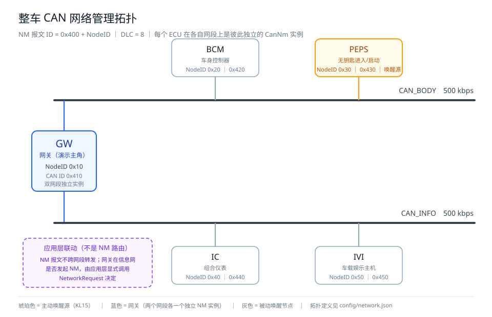
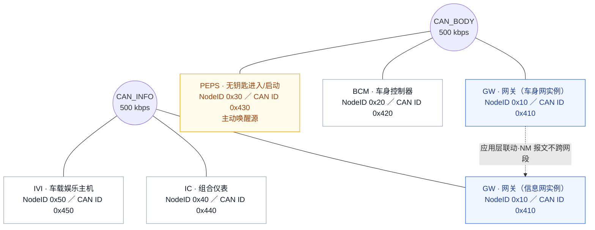

# 整车 CAN 网络管理拓扑

> 本图与 `config/network.json` 一一对应。改配置即可改拓扑，工具（界面节点卡片、报文表、
> 状态机实例）会自动跟着变，不需要动这张图的绘制代码。

---

## 1. 拓扑图



*矢量图，可无损放大；`docs/拓扑图.svg` 可直接拖进 Word / PPT 使用。*

如需位图版本（例如贴到不支持 SVG 的编辑器里），用同一张图的 2 倍分辨率版本：
[`docs/拓扑图.png`](拓扑图.png)（1920 × 1240）。

### 图例

| 颜色 | 含义 |
| --- | --- |
| 🟦 蓝色 | 网关 GW：**两个网段各一个独立的 CanNm 实例**（本演示的主角） |
| 🟧 琥珀色 | 主动唤醒源（本配置中为 PEPS，对应 KL15 事件） |
| ⬜ 灰色 | 被动唤醒节点：自己没有网络需求时随总线"同睡同醒" |
| 🟪 紫色虚线 | 网关应用层联动：**不是** NM 报文跨网段路由 |

---

## 2. Mermaid 版本（GitHub / VS Code 可直接渲染）



---

## 3. 纯文本版本（任何环境都能看）

```text
              BCM 0x20 ／ 0x420            PEPS 0x30 ／ 0x430  ★主动唤醒源
                    │                              │
    ┌───────────────┴──────────────────────────────┴───────────────┐
    │                     CAN_BODY   500 kbps                      │
    └───────────────┬──────────────────────────────────────────────┘
                    │
              ┌─────┴──────┐
              │   GW 网关   │        NodeID 0x10 ／ CAN ID 0x410
              │ 双网段实例  │        两个网段各跑一个独立的 CanNm 状态机
              └─────┬──────┘
                    │
    ┌───────────────┴──────────────────────────────────────────────┐
    │                     CAN_INFO   500 kbps                      │
    └───────────────┬──────────────────────────────┬───────────────┘
                    │                              │
              IC 0x40 ／ 0x440              IVI 0x50 ／ 0x450

    ★ 唤醒源            █ 网关（两个独立 NM 实例）
    ─ ─ ─ 虚线链路：应用层联动，不是 NM 报文路由
```

---

## 4. 网络管理地址分配

NM 报文 ID = **`0x400 + NodeID`**（11 位标准帧），DLC = 8，Byte0 为源节点地址。

| ECU | 中文名 | 所属网段 | NodeID | NM 报文 ID | 角色 |
| --- | --- | --- | --- | --- | --- |
| GW | 网关 | CAN_BODY + CAN_INFO | `0x10` | `0x410` | 演示主角；双网段各一个 NM 实例，两套状态互相独立 |
| BCM | 车身控制器 | CAN_BODY | `0x20` | `0x420` | 被动唤醒节点，无本地需求时进 Ready Sleep 等待 |
| PEPS | 无钥匙进入/启动 | CAN_BODY | `0x30` | `0x430` | **主动唤醒源**：KL15 上电时以 AWB=1 + 快速发送唤醒车身网 |
| IC | 组合仪表 | CAN_INFO | `0x40` | `0x440` | 被动唤醒节点，由网关应用层联动拉起 |
| IVI | 车载娱乐主机 | CAN_INFO | `0x50` | `0x450` | 被动唤醒节点，由网关应用层联动拉起 |

---

## 5. 三个必须讲清楚的设计点

### 5.1 网关为什么是两块"网卡"

`GW` 在两个网段上是**两个彼此独立的 CanNm 实例**，各自维护自己的状态、定时器和收发计数。
同一个 ECU，在 CAN_BODY 上可能是 NOS，同时在 CAN_INFO 上还是 BusSleepMode。

这直接决定了演示时能看到的现象：

- PEPS 在 CAN_BODY 上主动唤醒 → **CAN_BODY 的 GW 被被动唤醒，而 CAN_INFO 的 GW 依然在 BSM**；
- 界面上 GW 有两张状态卡片，它们可以长期处于不同状态。

### 5.2 NM 报文不跨网段路由

NM 报文是**网段内广播**的，规范里没有任何"网关转发 NM 报文"的机制。
所以 CAN_INFO 不可能被 CAN_BODY 上的 NM 报文自动拉起来。

真实车上让信息网醒来的路径是：网关应用层判断"需要显示/交互" → 调用**自己**在 CAN_INFO 上的
`CanNm_NetworkRequest()`。演示时这一步就是手动点一下 CAN_INFO 上 GW 的「KL15 上电」——
效果等价，只是把应用层的判断人工化了。

### 5.3 每个节点都遵循同一套状态机

5 个节点跑的是同一份状态机代码（`src/core/nm_node.py` + `nm_state.py` 的 30 条迁移表），
差别只在配置：NodeID、唤醒源、是否挂本地保持事件。

```
BusSleepMode ──网络需求──▶ PrepareBusSleepMode ──超时──▶ BusSleepMode
     │                              │
     └──── 本地/远程唤醒 ──▶ NetworkMode ──▶ RMS ──▶ NOS / RSS
```

---

## 6. NM 报文格式（8 字节）

| 字节 | 内容 | 说明 |
| --- | --- | --- |
| Byte0 | Source Node Identifier | 源节点地址，等于 CAN ID 的低 8 位 |
| Byte1 | Control Bit Vector | bit0 RMR（重复报文请求）、bit4 AWB（主动唤醒）、bit3 睡眠指示（位序待客户确认）、bit6 PNI |
| Byte2 | 网络管理状态 | 低 7 位状态码：1=RMS←BSM、2=RMS←PBS、4=NOS←RMS、8=NOS←RSS、16=RMS←NOS、32=RMS←RSS |
| Byte3 | 唤醒原因 | 0=初始化（仅首帧）、1=总线唤醒、2=KL15 上电、3~127=外设 I/O、128~255=功能唤醒 |
| Byte4 | 网络保持事件 | bit0 AC_0_KL15、bit1 AC_1_Diagnosis、bit2 AC_2_Tmin、bit3 AC_3_Remotecontrol、bit4 AC_4_OTA |
| Byte5~7 | 部分网络编号标志 | 规范标注"暂不实施"，发送时恒为 0 |

一个真实例子（PEPS 快速发送阶段的第二帧）：

```
ID 0x430   [30 10 01 02 05 00 00 00]
 Byte0=0x30 源地址 PEPS
 Byte1=0x10 AWB=1（主动唤醒）、RMR=0
 Byte2=0x01 状态码 1 = RMS<-BSM
 Byte3=0x02 唤醒原因 2 = KL15 上电
 Byte4=0x05 AC_0_KL15=1、AC_2_Tmin=1
```

---

## 7. 定时参数

| 参数 | 客户口径（默认） | 庆铃规范 V1.0 | 作用 |
| --- | --- | --- | --- |
| T_NMTxTimeout | 1000ms | 200ms | NM 报文正常发送周期 |
| T_NMTimeout | 2000ms | 3000ms | 离网超时；RSS 下超时进 PBS |
| T_ImmediateNmTimeout | 100ms | 20ms | 唤醒时的快速发送周期（5 帧） |
| T_REPEAT_MESSAGE | 1000ms | 1000ms | RMS 持续时长 |
| T_WAIT_BUS_SLEEP | 5000ms | 5000ms | PBS 持续时长，之后进 BSM |

切换口径：改 `config/network.json` 的 `profile`（`customer_a` / `qingling_v1`）。

---

## 8. 怎么改这张拓扑

拓扑是**数据驱动**的，改 `config/network.json` 即可（改完重启程序）：

```json
{
  "profile": "customer_a",
  "protocol": { "id_base": 1024, "dlc": 8 },
  "topology": {
    "channels": [
      {
        "name": "CAN_BODY",
        "bitrate": 500000,
        "nodes": [
          { "ecu": "GW",   "node_id": 16, "role": "网关（车身网侧）" },
          { "ecu": "BCM",  "node_id": 32, "role": "车身控制器" },
          { "ecu": "PEPS", "node_id": 48, "role": "无钥匙进入/启动（主动唤醒源）" }
        ]
      },
      {
        "name": "CAN_INFO",
        "bitrate": 500000,
        "nodes": [
          { "ecu": "GW",  "node_id": 16, "role": "网关（信息网侧）" },
          { "ecu": "IC",  "node_id": 64, "role": "组合仪表" },
          { "ecu": "IVI", "node_id": 80, "role": "车载娱乐主机" }
        ]
      }
    ]
  }
}
```

| 想改什么 | 改哪里 |
| --- | --- |
| 增删 ECU、改 Node ID | `topology.channels[].nodes[]`（`node_id` 用十进制，16 = 0x10） |
| 加一个网段 | 往 `channels` 里加一个对象即可，界面会多出一行节点卡片 |
| 改波特率 | `bitrate`（只影响单帧时长估算，不影响 NM 状态逻辑） |
| 改报文 ID 规则 | `protocol.id_base`（`1024` = 0x400；庆铃口径填 `418381056` = 0x18FFE100） |

配置加载时会校验：NodeID 必须在 `0x00~0xFF`、同一网段内不可重复、不可出现同名 ECU，
配错会直接报错并指出是哪一个。

> 如果后续要改这张**图**（比如换了 ECU 名称或加了网段），直接编辑 `docs/拓扑图.svg`
> 即可；也可以让工具按配置自动生成。

---

## 9. 与演示场景的对应

| 演示 | 涉及的节点 | 观察点 |
| --- | --- | --- |
| KL15 上电唤醒 | PEPS → BCM、GW(车身网) | PEPS 以 AWB=1 + 5 帧 100ms 快速发送；被唤醒的节点 AWB=0 |
| 同步休眠 | CAN_BODY 全部节点 | RSS 期间只要还有节点在发 NM 报文，其他节点就一直推迟睡眠 |
| 网关联动 | GW(车身网) → GW(信息网) | 两个网段状态互相独立，信息网必须由网关应用层显式拉起 |
| 网关保持一个网段清醒 | GW(信息网) | 车身网已睡、信息网还在 NOS —— 典型的"网关同时持有两套 NM 状态" |

---

*相关文档：`README.md`（运行手册）、`docs/状态机说明.md`（30 条状态迁移表，由代码自动生成）*
